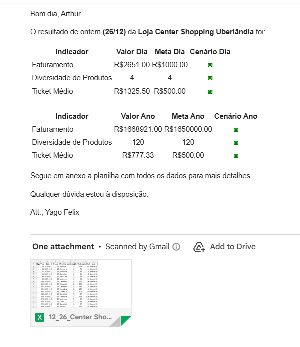

---

# 🏬 Mall Automation Analytics

Automated data pipeline designed to generate **daily store performance reports**, organize sales data by shopping mall, and send **personalized email dashboards** to store managers and the board of directors.

This project centralizes sales information, creates individual Excel files per store, evaluates KPI results against predefined goals, and delivers **OnePage-style performance summaries** automatically via Outlook.

---

## 📌 Overview

The **Mall Automation Analytics** system processes daily sales data from multiple stores and automates the entire workflow of:

* 📥 Importing and cleaning raw data
* 🔗 Merging store information
* 🏪 Splitting sales into individual datasets per store
* 💾 Creating daily backup folders
* 📊 Generating dynamic Excel reports
* 📈 Calculating daily and yearly KPIs
* 🟢🔴 Formatting green/red status indicators
* 📧 Sending personalized performance emails to store managers
* 🏆 Sending daily ranking reports to the board

This automation eliminates manual reporting work and ensures that all stakeholders receive updated KPIs every day.

---

## 🚀 Features

### **1. Data Integration**

Reads and processes data from:

* `Emails.xlsx`
* `Lojas.csv`
* `Vendas.xlsx`

Merging sales rows with store metadata.

---

### **2. Store-Level Data Separation**

Automatically creates a dictionary where each key is a store containing only its filtered sales.

---

### **3. Backup Folder Automation**

For each store:

* Creates a folder under `Backup Arquivos Lojas/`
* Generates a daily Excel file named:

  ```
  {date}_{store}.xlsx
  ```

---

### **4. KPI Calculation**

KPIs calculated daily and yearly:

* 💰 **Revenue**
* 📦 **Product Diversity**
* 🧾 **Average Ticket Size**

Each KPI is validated against predefined goals with color indicators (🟢 good / 🔴 below goal).

---

### **5. Automated Email Notifications**

Using **Outlook + win32com**, the automation sends:

#### ✔️ Email to each manager:

* OnePage HTML dashboard
* KPI indicators
* Daily Excel file attached

#### ✔️ Email to the board of directors:

* Best and worst stores of the day
* Best and worst stores of the year
* Ranking spreadsheets attached

---

### **6. Fully Automated Workflow**

Running the script once completes the entire process **end-to-end** with no manual intervention.

---

## 📂 Project Structure

```
mall-automation-analytics/
│
├── Bases de Dados/
│   ├── Emails.xlsx
│   ├── Lojas.csv
│   └── Vendas.xlsx
│
├── Backup Arquivos Lojas/
│   ├── Store A/
│   │   └── {date}_StoreA.xlsx
│   └── Store B/
│       └── {date}_StoreB.xlsx
│
├── Automacao de Processo/
│   └── main.py
│
└── README.md
```

---

## 📸 Output Example

This screenshot represents the email sent daily to each store manager:

* OnePage HTML dashboard with daily KPIs
* Green/red performance indicators
* Consolidated daily metrics
* Automatic Excel file attachment
* Standardized layout for all stores



---

## ▶️ How to Run the Project

### 📥 1. Clone the Repository

```bash
git clone https://github.com/yagofelix00/mall-automation-analytics.git
cd mall-automation-analytics
```

### 📦 2. Install Dependencies

```bash
pip install -r requirements.txt
```

> Ensure Python 3+ is installed.

---

### ⚙️ 3. Configure the Data Files

Place the following files inside:

```
Bases de Dados/
├── Emails.xlsx
├── Lojas.csv
└── Vendas.xlsx
```

---

### ▶️ 4. Run the Automation Script

```bash
python Automacao\ de\ Processo/main.py
```

Windows users can also double-click `main.py`.

---

## 🛠️ Technologies Used

- **Python 3**
- **Pandas** — data manipulation and cleaning  
- **NumPy** — numeric operations  
- **OpenPyXL** — Excel file generation  
- **Win32com / Outlook API** — automated email sending  
- **OS & Pathlib** — directory and file handling  
- **HTML/CSS** — OnePage dashboard design  

---

## 📝 Notes

* Outlook must be installed and logged in (email automation depends on it).
* All data used in this project is **fictional**, created only for study and demonstration.
* This project was built to practice:

  * ETL
  * Data cleaning
  * KPI generation
  * Excel automation
  * Email automation using Python

---

## 🔮 Future Improvements

- Add a structured logging system (info, warning, error levels)
- Implement modular architecture to split the pipeline into components
- Add unit tests for KPI calculations and email generation
- Convert scripts into a package with CLI support
- Add a dashboard version using Flask or Streamlit
- Add real-time monitoring and error alerts
- Create an automated data validation step before processing

---

## 💼 Business Impact

* Eliminates manual daily consolidation of 50+ store reports

* Reduces time spent by managers by 90%

* Ensures daily KPI visibility for decision-makers

* Prevents errors from manual data manipulation

* Standardizes communication across all stores

---

## 👤 Author

**Yago Félix**  
💼 Python Developer — Back-end | Data Analytics | Full Stack  
🔍 Focused on building automated solutions, data pipelines, and robust applications using Python.  
📊 Interested in Data Analytics, SQL, ETL processes, APIs, Web Automation, and full-stack development with Python.  
🔗 More projects: https://github.com/yagofelix00  

---


